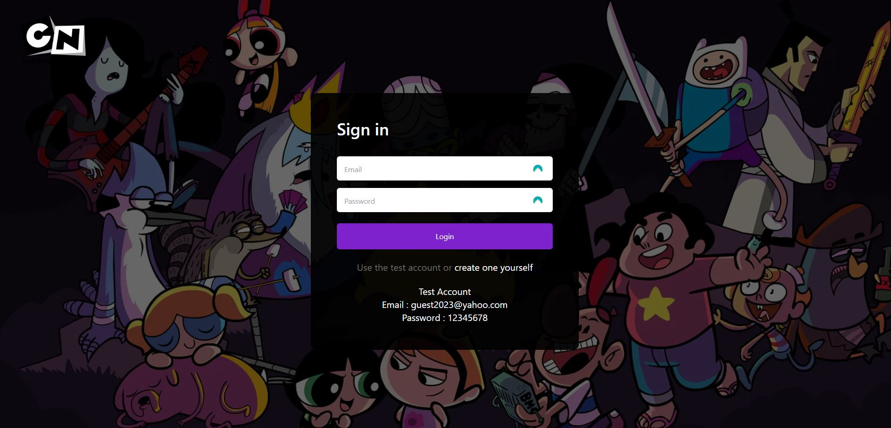
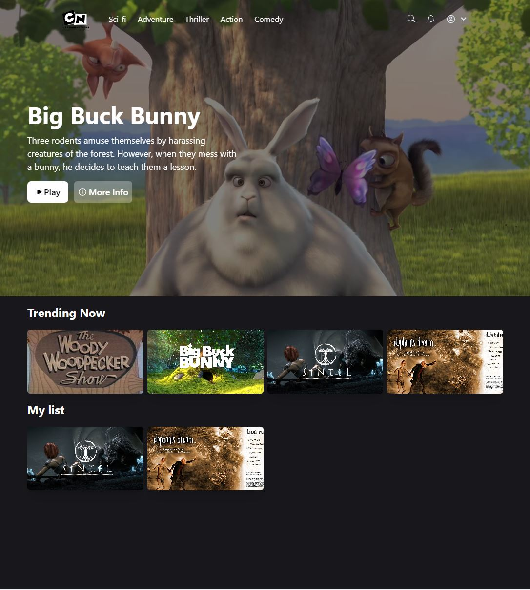

# Cartoon App


Cartoon App is a web application where users can browse, watch, and favorite different cartoon movies. Users can filter movies by categories, providing a user-friendly interface for cartoon enthusiasts. 

## Features

- **Account Creation and Authentication**: Users can create their own account or use the guest account to browse the website. Authentication is implemented using NextAuth.

- **Watch and Favorite Movies**: Users can watch their favorite cartoon movies directly on the site. They can also add movies to a favorites list for quick access in the future.

- **Filter by Categories**: Users can filter movies by categories, making it easier to find the type of cartoon movies they want to watch.

## Screenshots

### Login Page

<div align="center">
  
</div>

### Home Page

<div align="center">
  
</div>

## Built With

- [React](https://reactjs.org/)
- [Next.js](https://nextjs.org/)
- [MongoDB](https://www.mongodb.com/)
- [Prisma](https://www.prisma.io/)
- [NextAuth](https://next-auth.js.org/)
- [Framer Motion](https://www.framer.com/motion/)
- [Zustand](https://zustand.surge.sh/)
- [React Hook Form](https://react-hook-form.com/)
- [React Icons](https://react-icons.github.io/react-icons/)
- [SWR](https://swr.vercel.app/)
- [Tailwind CSS](https://tailwindcss.com/)
- [Axios](https://axios-http.com/)
- [bcrypt](https://www.npmjs.com/package/bcrypt)
- [ESLint](https://eslint.org/)

## Installation

To run the application locally, follow these steps:

1. Clone the repository.
    ```
    git clone https://github.com/GabrielStefan24/cartoon-app.git
    ```


2. Install dependencies.
    ```
    cd cartoon-app
    npm install
    ```

3. Start the development server.
    ```
    npm run dev
    ```

4. Open [http://localhost:3000](http://localhost:3000) in your browser.

## Contributing

Pull requests are welcome. For major changes, please open an issue first to discuss what you would like to change.

## License

This project is licensed under the MIT License - see the [LICENSE.md](LICENSE.md) file for details. <!-- Replace with your license -->

## Contact

Your Name - [Email](mailto:sirbugabriel97@gmail.com) 
